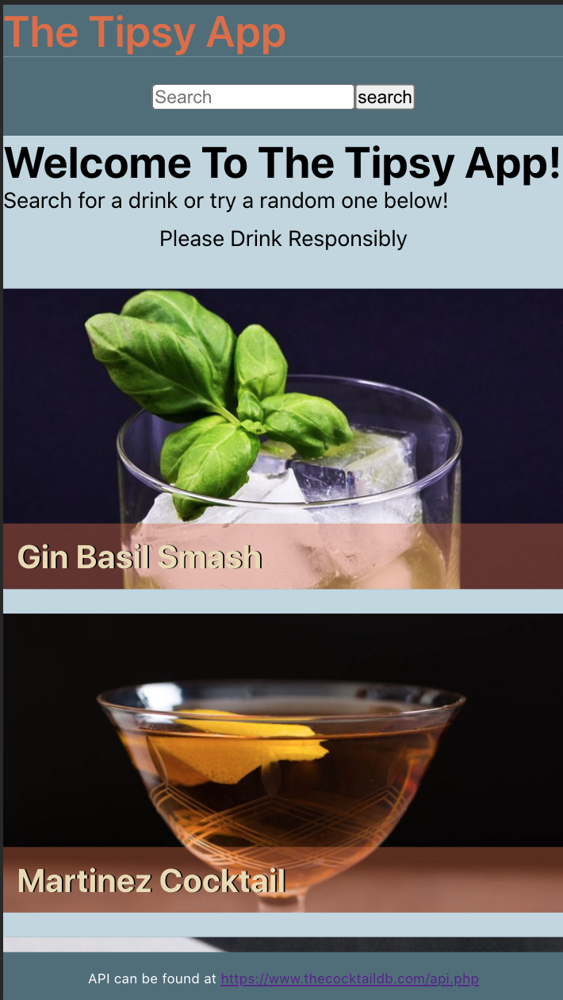

# The Tipsy App
My first application using React. The app displays a list of 10 random drinks on the homepage which all are links to an ingredients/ instructions page. The user can also   

## Project Link
### [The Tipsy App](https://markrissmiller.github.io/The-Tipsy-App/)

## Contributors
* **Mark Rissmiller** https://github.com/markrissmiller

## Technologies Used
* React
* JavaScript
* HTML5
* CSS

## Challenges/Future Goals/ Bugs
* Currently designed primarily as a mobile app with some desktop display features with drastic bugs. 
    * update css to be desktop responsive 
* Update the search navigation to be more flexible( search by: ingredients, multiple ingredients, alcoholic/ non-alcoholic, etc.)

## Screenshots
  

## Special Thanks
* Thank you to the General Assembly SEIR-ERICA instructional team and classmates for support and mentorship. 